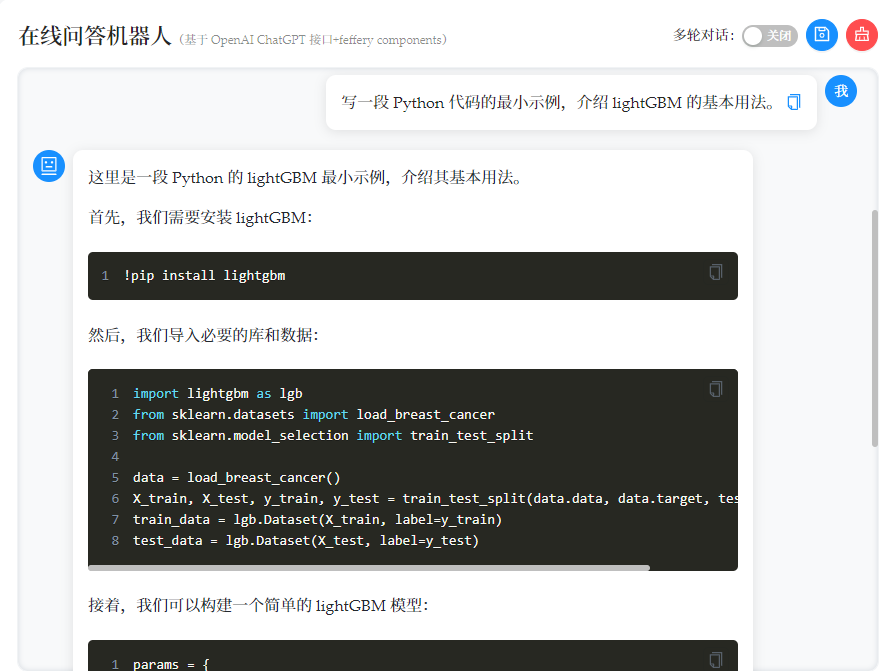
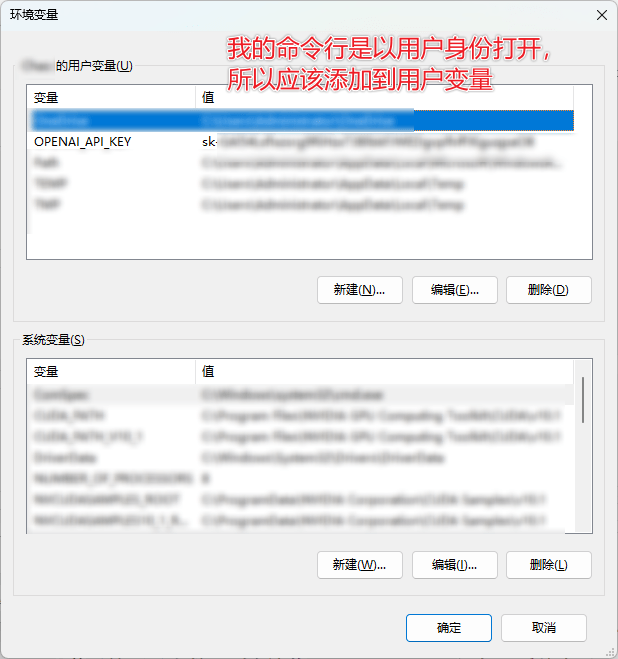
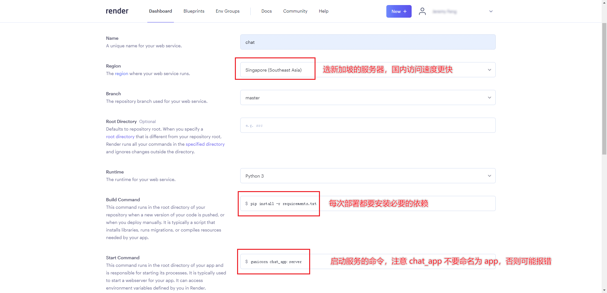
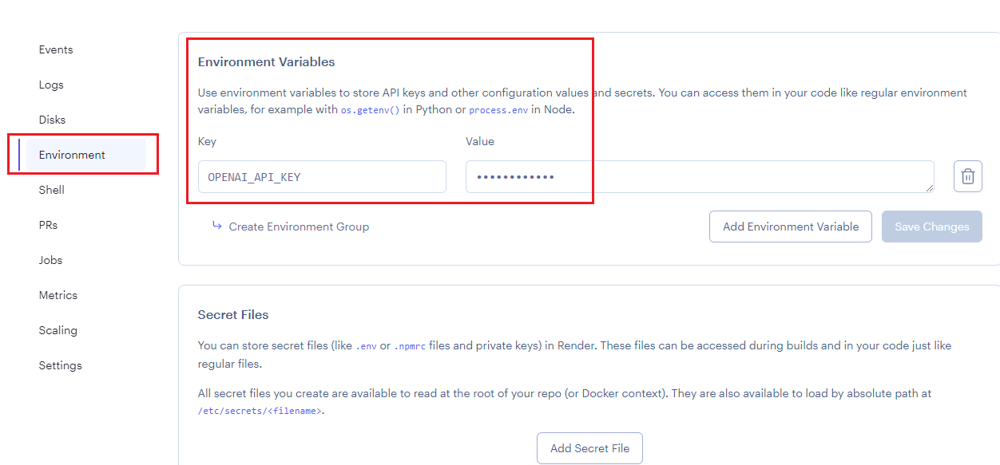

# 基于 ChatGPT 的在线问答机器人

基于 OpenAI ChatGPT 接口和 feffery components 构建在线问答机器人，并基于 [`render`](https://render.com/) 实现自动化持续部署。

它支持：

1. 开启多轮对话模式，它将记住你之前的问题。
2. 导出当前对话记录为 Markdown 文件，你可以将其保存到本地。
3. 一键清空当前对话记录。

[使用它！](https://chat.fengchao.pro/)

## ChatGPT 接口和 Dash 应用介绍

OpenAI 在 3 月 2 日发布了 gpt-3.5-turbo，这是 GPT-3（Generative Pre-trained Transformer 3）模型的最新版本，它拥有更快的处理速度和更低的成本（100 万词的对话大约只需要 10 多元人民币）。

公众号`玩转 Dash`的费老师分享了[基于 ChatGPT 官方接口快速开发对话机器人](https://mp.weixin.qq.com/s/uChFd32sOYvZKrbe9XhRuA)和[支持多轮对话、记录导出，纯 Python 开发 ChatGPT 对话机器人应用](https://mp.weixin.qq.com/s/fABGNu_gEwNvJWzf5-qZCw)，我根据这些教程搭建了基于 ChatGPT 的在线问答机器人，并在 [`render`](https://render.com/) 上实现了自动化持续部署。

## 本地构建

### 核心步骤

参考[基于 ChatGPT 官方接口快速开发对话机器人](https://mp.weixin.qq.com/s/uChFd32sOYvZKrbe9XhRuA)和[支持多轮对话、记录导出，纯 Python 开发 ChatGPT 对话机器人应用](https://mp.weixin.qq.com/s/fABGNu_gEwNvJWzf5-qZCw)，按照如下几步即可在本地构建 Dash 应用：

1. 将代码下载到本地，进入代码所在目录，创建虚拟环境并激活。

   ```bash
   conda create -n chatgpt-bot python=3.8 -y
   conda activate chatgpt-bot
   ```

2. 通过`pip install -r requirements.txt`安装依赖

3. 在`config.py`中填入自己的 `openai_api_key`。

4. 通过`python app.py`在本地构建 Dash 应用。

[](https://chat.fengchao.pro/)

### 进阶配置

到此我们应该能够在 `http://127.0.0.1:8050` 看到已经成功构建的 Dash 应用了，但可能会遇到一些问题：

#### 网络问题

设定命令行运行的参数，如果带有参数`local`，则开启`PROXY`，其中`10809`是`PROXY`网络的端口号，我们需要找到自己的`PROXY`网络的端口号填进去。

```python
import sys

if len(sys.argv) > 1 and sys.argv[1] == "local":
    import os

    os.environ["HTTP_PROXY"] = "http://127.0.0.1:10809"
    os.environ["HTTPS_PROXY"] = "http://127.0.0.1:10809"
```

在本地构建时，用`python app.py local`即可。

如果你只在本地运行，也可以不用加入命令行参数，也就是把 `#!py if sys.argv[1] == "local":` 删去，默认使用 PROXY。

我这里加入了命令行参数，是因为我最终需要部署到 render 上，render 是不用开启 PROXY 就能使用 OpenAI 的。

当我在本地运行时，就用命令行参数指定网络端口。而在 render 上持续部署时，默认是不会开启指定的网络端口的。

#### 将`openai_api_key`存放为环境变量

`openai_api_key`是私人的密钥，不应该暴露在公共环境中。如果需要将代码上传到 GitHub 等平台，可以设置环境变量，这样可以将`openai_api_key`隐藏，但不影响应用的运行。

注意命令行是否以管理员身份打开：

1. 若不是管理员身份，则应该将`openai_api_key`添加到用户变量。
2. 若是管理员身份，则应该将`openai_api_key`添加到系统变量。



在`config.py`读入环境变量：

```python
import os

class Config:

    # 请填入你的 openai API key
    openai_api_key = os.getenv("OPENAI_API_KEY")

```

## 基于 render 实现自动化持续部署

将代码上传到 GitHub 后，在 [`render` ](https://render.com/)上配置：



1. 服务器区域，建议选新加坡，离中国最近，访问速度可能比较好。

2. Build Command

	``` "Build Command"
	pip install -r requirements.txt
	```

	注意：`requirements.txt` 中需要包含 `gunicorn`，否则无法运行`gunicorn`。

3. Start Command

	``` "Start Command"
	gunicorn chat_app:server
	```

	注意我们需要把 `app.py` 先重命名为 `chat_app.py`（你也可以命名为其他名字，只要不是`app.py`即可），否则 `gunicorn app:server` 会出现命名冲突导致部署失败。参考：[https://community.render.com/t/what-is-the-correct-start-command-for-a-python-dash-app/5740](https://community.render.com/t/what-is-the-correct-start-command-for-a-python-dash-app/5740)

4. 如果`OPENAI_API_KEY`是环境变量的形式存放，则还需要设置 Environment。

	

这样就能够实现自动化持续部署了，当 GitHub 代码仓库有更新时，Dash 应用也会自动部署更新。

## 其他部署方法：在自建服务器使用 Nginx 实现端口转发

我在自建服务器上尝试部署 Dash 应用，但遇到了许多麻烦的事，例如：

### 端口转发：已实现

参考：[Windows 10 nginx 安裝及问题解决 设置 80 端口代理](https://blog.csdn.net/jackuhan/article/details/78796205)

配置 host 后默认请求到 80 端口，而 80 端口一般被各种系统服务占用。Dash 的默认服务端口为 8050，需要通过 Nginx 做端口转发，方法如下。

删除 nginx.conf 中 server 部分配置，替换成下面配置：

```
server {
    listen 80;
    location / {
        proxy_pass http://127.0.0.1:8050; # 应用服务器HTTP地址
        proxy_set_header Host $http_host;
        proxy_set_header X-Real-IP $remote_addr;
        proxy_set_header X-Forwarded-For $proxy_add_x_forwarded_for;
        proxy_set_header X-Forwarded-Proto $scheme;
    }
}
```

### 配置 SSL 证书实现 HTTPS 加密访问，未实现

从域名服务商下载 SSL 证书后需要在 Nginx 进行配置，我最终没能达到加密访问的效果，遂放弃。

参考：[腾讯云：Nginx 服务器 SSL 证书安装部署](https://cloud.tencent.com/document/product/400/35244)


自建服务器还有很多缺点，例如：

1. 不易维护。证书、网络、性能都是需要自己管理并维护的，不是很让人省心。
2. 有一定的成本。每年需要花几百元购买服务器。
3. 需要很多进阶的配置。要想实现 HTTPS、自动化持续部署等实用功能，需要学习更多的技术。如果我们不是专业的运维人员，需要在这些方面花费大量时间。

所以我还是推荐使用专业的部署平台（如 [render](https://render.com/)、[vercel](https://vercel.com/)、[heroku](https://www.heroku.com/) 等），免费版本的功能和额度已经足够用了，它们实在是让人省心不少。或者使用 GitHub Actions 实现持续集成、持续部署，不过访问速度可能稍慢。

真心感恩这些为所有人提供优质服务的开发者们。

